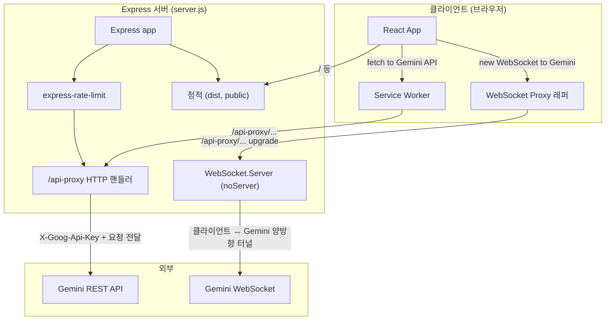
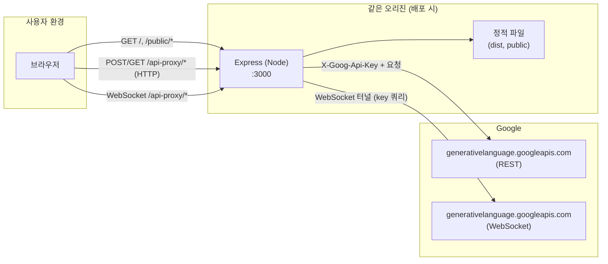

# Front Vibe-Coding Backend Template

React 프론트엔드와 Gemini API 프록시 백엔드를 함께 사용할 수 있는 **풀스택 템플릿**입니다. 프론트는 Vite + React로 빌드하고, 백엔드는 Express 서버가 정적 파일 서빙과 Gemini HTTP/WebSocket 프록시를 담당합니다.

---

## 1. 프로젝트 목적

- **Gemini API 프록시**: 클라이언트에서 API 키를 노출하지 않고, 서버를 경유해 Google Generative Language API(Gemini)에 HTTP 및 WebSocket 요청을 전달합니다.
- **프론트엔드 템플릿**: React(Vite) 기반 프론트를 루트에 두고, `npm run build`로 생성된 `dist/`를 백엔드가 서빙하는 구조를 제공합니다.
- **배포 준비**: Dockerfile로 프론트 빌드 + 서버 이미지를 한 번에 만들 수 있어, 단일 컨테이너로 배포할 수 있습니다.
- **보안·안정성**: Rate limiting, CORS 처리, 스트리밍 응답 지원으로 프록시 사용을 제어하고, Service Worker·WebSocket 인터셉터로 클라이언트 요청을 같은 오리진의 `/api-proxy`로 우회시킵니다.

---

## 2. 프로젝트 디렉토리 구조

```
front-vibecoding-backend-templete/
├── .env.example              # 환경 변수 예시 (GEMINI_API_KEY)
├── .gitignore
├── Dockerfile                # 멀티스테이지 빌드: 프론트 빌드 + 서버 이미지
├── FRONTEND_VIBE_AGENT_INSTRUCTIONS.md   # 프론트 교체 시 에이전트용 규약
├── README.md                 # 본 문서
├── package.json              # 루트: 프론트엔드 의존성 및 dev/build 스크립트
├── vite.config.ts            # Vite 설정 (포트, env 주입, alias)
│
├── server/                   # 백엔드 (Express)
│   ├── package.json          # 서버 전용 의존성 (express, ws, axios 등)
│   ├── server.js             # 엔트리: HTTP 서버, /api-proxy, WebSocket 업그레이드, 정적 서빙
│   └── public/               # 서버가 제공하는 정적 스크립트
│       ├── service-worker.js       # Gemini API 요청을 /api-proxy로 리다이렉트
│       └── websocket-interceptor.js # 브라우저 WebSocket을 프록시 URL로 우회
│
└── dist/                     # (빌드 시 생성) 프론트 빌드 산출물 → 서버가 정적 서빙
    └── index.html            # 루트 경로(/)에서 서빙
```

- **루트**: 프론트엔드 소스 및 설정. `npm run dev` / `npm run build`는 여기서 실행합니다.
- **server/**: Express 앱과 프록시·정적 서빙 로직. Docker 최종 이미지는 이 디렉터리 + `dist/`를 포함합니다.
- **server/public/**: API 키가 설정된 경우 `index.html`에 주입되는 스크립트(Service Worker 등록 코드 + WebSocket 인터셉터)가 로드하는 파일들이 위치합니다.

---

## 3. 프로젝트 코드별 역할과 기능

| 경로 | 역할 및 기능 |
|------|------------------|
| **package.json** (루트) | 프론트엔드 패키지(vibewallpaper). `dev`(Vite), `build`(Vite build), `preview` 스크립트. React, @google/genai, lucide-react 등 의존성. |
| **vite.config.ts** | Vite dev 서버 포트 3000, `GEMINI_API_KEY`/`API_KEY`를 `process.env`로 주입, `@` alias 설정. |
| **Dockerfile** | Stage1: 루트에서 `npm run build` → `dist/` 생성, server 의존성 설치. Stage2: server 파일 + `dist/`만 복사한 최종 Node 이미지, `node server.js` 실행. |
| **server/package.json** | 백엔드 패키지(appletserver). express, axios, ws, dotenv, express-rate-limit. `start` / `dev`(nodemon) 스크립트. |
| **server/server.js** | **Express 앱**: (1) `/api-proxy` Rate limit 적용 (2) `/api-proxy` HTTP 프록시 → Gemini REST API, 스트리밍 응답 전달 (3) `/api-proxy` WebSocket 업그레이드 → Gemini WebSocket 프록시 (4) `/` → `dist/index.html` 서빙(있으면 스크립트 주입), 없으면 `public/placeholder.html` 폴백 (5) `/service-worker.js`, `/public/*` 정적 파일 (6) `dist/` 정적. |
| **server/public/service-worker.js** | `generativelanguage.googleapis.com`으로 가는 fetch를 가로채서, 같은 오리진의 `/api-proxy...`로 프록시 요청. install/activate 시 `skipWaiting`·`clients.claim`. |
| **server/public/websocket-interceptor.js** | `window.WebSocket`을 Proxy로 래핑. `generativelanguage.googleapis.com` 호스트로의 연결을 현재 오리진의 `/api-proxy` WebSocket URL로 변경. |
| **.env.example** | `GEMINI_API_KEY` 예시. 실제 키는 `.env` 또는 `.env.local` 등에 설정. |
| **FRONTEND_VIBE_AGENT_INSTRUCTIONS.md** | 프론트만 교체할 때 에이전트가 지켜야 할 규약: 빌드 결과는 반드시 루트 `dist/`, `/api-proxy` 상대 경로 사용 등. |

---

## 4. 프로젝트에서 구성된 객체 관계도

아래는 런타임에서 주요 객체들이 어떻게 연결되는지를 요약한 다이어그램입니다.



- **클라이언트**: React 앱이 Gemini로 보내려는 HTTP 요청은 Service Worker가, WebSocket 연결은 WebSocket Proxy 래퍼가 가로채서 같은 오리진의 `/api-proxy`로 보냅니다.
- **서버**: Express가 Rate limit 적용 후 `/api-proxy`를 HTTP 프록시와 WebSocket 업그레이드로 처리하고, 나머지 경로는 정적 파일로 서빙합니다.
- **외부**: HTTP는 Gemini REST API, WebSocket은 Gemini WebSocket 엔드포인트와 통신합니다.

---

## 5. 프로젝트에서 구성하는 서버의 관계도

네트워크 상에서 프론트·백엔드·Gemini가 어떻게 연결되는지 나타낸 다이어그램입니다.



- **브라우저 → Express**: 페이지, 정적 자산, 모든 API 호출·WebSocket이 같은 호스트/포트(예: `:3000`)로 갑니다.
- **Express → Gemini**: API 키는 서버에만 있고, Express가 REST와 WebSocket 요청을 Gemini 쪽으로 대신 전달합니다.

---

## Run Locally

**Prerequisites:** Node.js

1. Install dependencies:
   ```bash
   npm install
   ```
2. Set the `GEMINI_API_KEY` in [.env.local](.env.local) (or `.env`) to your Gemini API key.
3. Run the app:
   ```bash
   npm run dev
   ```

(백엔드만 실행하려면 `server/`에서 `npm run dev` 또는 `npm start`를 사용합니다. 이 경우 프론트는 미리 `npm run build`로 `dist/`를 만들어 두어야 합니다.)

---

## 학습용 문서

- **[docs/GLOSSARY.md](./docs/GLOSSARY.md)** — 프로젝트에서 사용하는 전문 용어(프록시, CORS, WebSocket, Service Worker, Rate Limit 등)를 주니어가 이해할 수 있도록 풀어 쓴 용어 정리입니다. 코드와 주석을 읽을 때 함께 참고하면 좋습니다.

---

## Frontend vibe-coding instructions (React)

백엔드 템플릿(`server/` + `Dockerfile`)은 유지한 채, 새로운 React 프론트만 붙이려면 다음 문서를 따르세요.

- [**FRONTEND_VIBE_AGENT_INSTRUCTIONS.md**](./FRONTEND_VIBE_AGENT_INSTRUCTIONS.md)

요약: 루트에서 `npm run build`가 성공하고, 빌드 결과가 **루트의 `dist/`**에 생성되어야 하며, 프론트에서는 `/api-proxy/...` 상대 경로로 API를 호출합니다.
